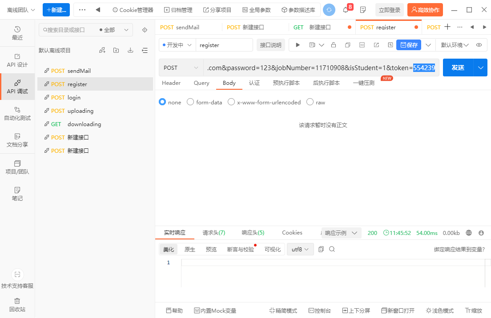
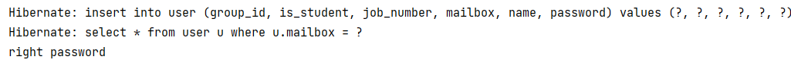

# [CS304] Team Project - Final-Report

Project Name:Sustech Intelligent Manufacturing End-of-Term Project Display Platform

Project Member:hou yuxuan,chen panpan,luo ao,liu yuyu,li wenkai

## 1. Metrics

### 1.1.1 Lines of Code:

### front-end: 10298

### back-end: 1705

### 1.1.2 Number of modules ：114

### 1.1.3 Number of packages ：6

### 1.1.4 Number of source files ：21

### 1.1.5 Number of 3rd dependencies ：62

### 1.2 What is the maintainability of your team project ？

We conducted a horizontal comparison with a project on a hotel management website. 

From the comparison results, it can be seen that the code volume of the other party's project is three times that of ours, and the number of methods is five times that of ours. The maintainability of the project is slightly higher than ours. From the above comparison, it is not difficult to infer that the average amount of code under each other's project method is less than our method. When a method's code is too high, it can lead to a decrease in overall project maintainability.

## 2. Documentation

### 2.1 Documentation for End Users

Please click https://github.com/sustech-cs304/team-project-233/blob/main/README.md to see our guider. 

### 2.2 Documentation for Developers

#### 2.2.1 API

We use swagger to management API, you can see API as following pictures at http://localhost:8080/swagger-ui.html when you run the backend code.

#### 2.2.2 Design

Here is the database design.

#### 2.2.3 Code Structure

Backend code structure:

Frontend code structure:

## 3. Tests

### 3.1 Reason for Manual Tests

1. Our project was front end separated, and automated testing didn't test the interface calls on front end well, so we used manual testing.
2. We need to conduct a series of tests for some functions, which are related before and after, as well as the changes of the front end and the back end and the database. The results of manual tests are intuitive and can better reflect the logic.

### 3.2 Test Case

We mainly used api test 7 for manual testing, mainly for front and back end interface testing.

#### 3.2.1 Test Case 1

1. Registration and login link of the test process, the first to send a verification code to the mailbox.

2. Then the verification code is obtained successfully.

3. Register according to the verification code.

4. The database starts with no data.

5. Registration succeeded after sending.

6. Then log in.

7. If a correct password is displayed on the back-end, the login succeeds.

#### 3.2.2 Test Case 2

1. First, the file is uploaded.

2. Save in the server, and the data record just passed in the file path and related information.

3. And then I download it, I get the file, I send a request to the interface, I get the pdf file successfully.

## 4. Build

For the project, we utilized Maven, npm, and Vite as the key technologies and tools to implement the automated build process for compiling source code, assembling dependencies, and producing executables. The build process involved the following tasks:

- Dependency Resolution: Maven resolved the project's Java dependencies by fetching the required libraries from remote repositories specified in the pom.xml file. npm resolved the frontend dependencies by retrieving the specified packages from the npm registry.
- Compilation: Maven compiled the Java source code into bytecode, generating the necessary class files. The compilation process ensures that the code adheres to the specified Java version and identifies any compilation errors.
- Packaging: Vite processed the frontend assets, including Vue components, JavaScript files, CSS stylesheets, and other static resources. It transformed and bundled these assets into optimized formats suitable for deployment.
- Testing: Maven and npm can be integrated with testing frameworks such as JUnit or Jest to execute automated tests during the build process. These tests help verify the correctness and reliability of the code.

The successful build produced the following artifacts:

- Java Executable: Maven generated a JAR (Java ARchive) file containing the compiled Java classes and resources. This JAR file can be executed in a Java runtime environment to run the Spring Boot application.
- Frontend Assets: Vite created a bundle of optimized JavaScript, CSS, and HTML files, along with other static resources required for the Vue.js frontend. These assets are ready for deployment to a web server or a hosting platform.

For further details and specific configurations, please refer to the project's build configuration files and scripts:

- Maven build configuration (pom.xml): [pom.xml](pom.xml)
- npm configuration (package.json): [package.json](project-demo/package.json)
- Vite configuration (vite.config.js): [vite.config.js](project-demo/vite.config.js)

These files outline the project's dependencies, build steps, and any custom configurations applied during the build process.

## 5. Deloyment

### 5.1 Tools

Docker plugin, IntelliJ IDEA, Maven

In idea, docker plug-ins and maven tools are used to package and generate jars.

### 5.2 Script

### 5.3 Prof

1. A snapshot of a successful docker build.

2. Show docker images.

3. Run docker container and curl.

