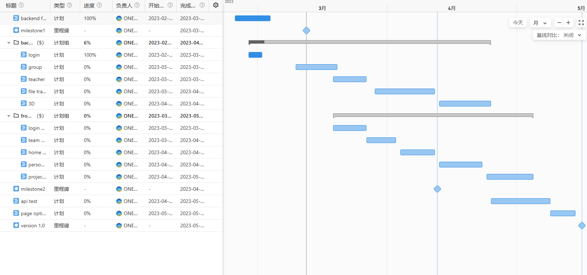
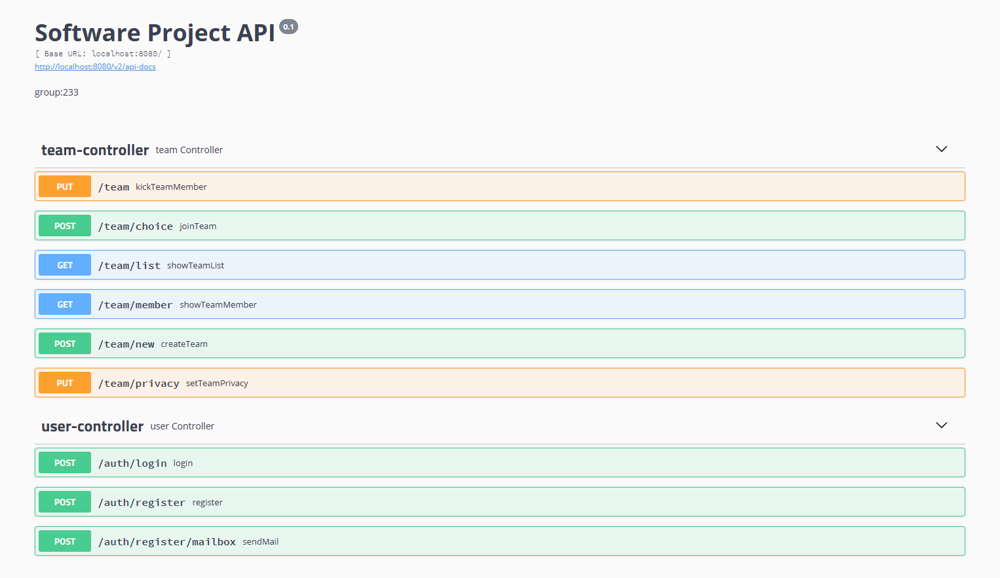

# [CS304] Requirement Analysis Report

Project Name:Sustech Intelligent Manufacturing End-of-Term Project Display Platform

Project Member:hou yuxuan,chen panpan,luo ao,liu yuyu,li wenkai

## Revision History
| Data      | Revision Version | Description      |Author     |
| :----:       |    :----:   |      :----: |         :----: |
| 2023-02-24      | V0.1       | for test    | 233   |
|              |         |                    |            |

## 1. Overview

### 1.1 Motivation and Background
In the final project of the intelligent manufacturing major at Southern University of Science and Technology, students will make a physical tool by themselves. In the final presentation, they will show their projects by shooting videos and other means, which is not convenient. They wanted a platform where they could display their projects in 3D, where they could view their models on the web. So our group will make a web page to show their project.

### 1.2 Target User or Clients Characteristics

Our program is mainly aimed at teachers and students majoring in intelligent manufacturing in Southern University of Science and Technology. Students can submit and upload their final projects on our platform, and teachers can check the final projects of all teams and give feedback by logging in to the website.

### 1.3 Project Scope
### 1.3.1 Objective
This project will serve the teachers and students of Sustech's intelligent manufacturing major, and provide them with a display and communication platform for their final projects.

### 1.3.2 Scope
The website will provide functions for teachers and students to log in and register, groups, 3D project display, video pdf and other file transmission and playback, teachers' review and comments, and tourists' comments.

### 1.3.3 Deliverable
We will conduct the first Milestone 2 Deliverable on April 12, including login registration, group, and file transfer. We will release version1 on May 16th, including the complete functions in the functional requirements.

### 1.3.4 Boundary
This work is only carried out until the local debugging is completed, and will not involve subsequent deployment to the server.

### 1.3.5 Constraints
In the project plan, there is no specific requirement for the final page beautification, which is decided by our vote. Other work needs to be completed on time according to the schedule.

### 1.4 Overall Goal
Finally, we will provide a website deployed on the server, which allows students to log in and register to create corresponding groups, upload their project-related materials and project models in the groups, and browse and evaluate the projects of other project teams. At the same time, teachers can log in the website, view the projects submitted by different groups of students, and give feedback on the website according to the content of the projects.

## 2. Development Process

### 2.1 Process Models
THE WATERFALL MODEL
We use this model because it fits our intuition. Use this process to facilitate planning and management within our group.

### 2.2 Project Schedule

Project Manager: hou yuxuan

Testing engineer：liu yuyu, li wenkai, luo ao

Designer：chen panpan

Frontend Developer: liu yuyu, li wenkai, luo ao

Backend Developer: hou yuxuan, chen panpan

## 3. Suggested Deliverables

### 3.1 Milestone 2 Deliverable
We hope in the milestone 2 release a simple version, to be able to log in to register, can complete the project within the file upload download, can display the project home page, at the same time provide the comment function. In this stage, we will complete the debugging of the front and rear end interfaces to confirm that the currently completed plate can run smoothly

### 3.2 Milestone 3 Deliverable
### 3.2.1 Login and registration
1. Students log in, register, and bind email
2. The teacher logs in and registers, and binds the mailbox

### 3.2.2 Student group function
1. Create a group and join it
2. Enable or Disable
3. View other groups

### 3.2.3 3D display
1. cad obj, 3ds, stl, ply, gltf and other formats are acceptable
2. Zoom in, zoom out, rotate and other operations on the web page to view the 3D view

### 3.2.4 Video transmission play, pdf upload download
1. Support for transferring and playing.mp4 files
2. Support.pdf file uploading and downloading
3. Support.ppt file uploading and downloading

### 3.2.5 Teacher review and comment
1. Teachers can view all group content
2. Teachers can leave comments and send them to students' email addresses

### 3.2.6 Tourist browse
1. Watch 3D projects and send comments
2. Click on heat

## 4. Requirements

### 4.1 Functional Requirements

| Index      | Name | Description      | 
| :----:       |    :----:   |      :---- |      
|Functional Requirement 1   |  User management      | Students and teachers should be able to register and log in with email                   |       
|  |       |   Students and teachers should have separate registration and login pages                 |  
|  |    |   Email verification should be mandatory for both types of users                    |  
|Functional Requirement 2   |  Student group management      | Students should be able to create and join groups                  | 
|   |       |        Groups should have an option to set their status as public or private          | 
|   |       |      Students should be able to view other groups            | 
|Functional Requirement 3   | 3D display      | The website should accept .cad obj, 3ds, stl, ply, gltf, etc. file formats for 3D models                | 
|   |       |       The 3D models should be viewable on the website, with options for zooming, rotation, etc        | 
|Functional Requirement 4   |  Video streaming and file uploads      | The website should support the streaming and playing of .mp4 files                  | 
|   |       |       The website should support the uploading and downloading of .pdf and .ppt files         | 
|Functional Requirement 5   | Teacher feedback and review     | Teachers should be able to view the content of all student groups                 | 
|   |       |       Teachers should be able to leave feedback and send it to students' email addresses         | 
|Functional Requirement 6   |  Visitor browsing and viewing      | Visitors should be able to view 3D projects and leave comments                 | 
|   |       |        Visitors should be able to view the popularity of projects         | 

### 4.2 Non-Functional Requirements

| Name      | Index | Description      |
| :----:       |    :----:   |      :---- |   
| Security      |1     |The website should implement secure authentication and data encryption to protect users' information    | 
|              |  2       |  The website should have protection against hacking and other security threats                  | 
| Performance      |1     | The website should be fast and responsive to ensure a smooth user experience    | 
|              |  2       |    The website should be able to handle a large number of concurrent users and requests                | 
| Compatibility      |1     | The website should be compatible with multiple browsers and devices to ensure broad accessibility   | 
| Scalability      |1     | The website should be designed with scalability in mind to accommodate future growth and expansion    | 
|              |  2       | The website should be easily modifiable and upgradable to keep up with changing user needs and technological advancements                   | 

## 5. Constraints

### 5.1 Operation Environment

| Running Environment      | Description |    
| :----:       |    :----:   |      
| Operating System      | The system should be compatible with commonly used operating systems like Windows, macOS, and Linux.      | 
| Web Browser             |   The web application should work with major web browsers like Chrome, Firefox, Safari, and Edge.      |     
| Internet Connectivity      |Users should have stable internet connectivity to access the web application and its features.      | 
| Hardware Requirements            |    The system should be optimized to work on low-end devices to ensure accessibility to a wider audience. It is also important to consider hardware requirements for the 3D visualization feature, as it may require a higher-end graphics card.     |   

### 5.2 Design and Implementation

The backend uses the spring boot framework, java language. The front-end uses the vue.js framework, js. The database uses mysql.

