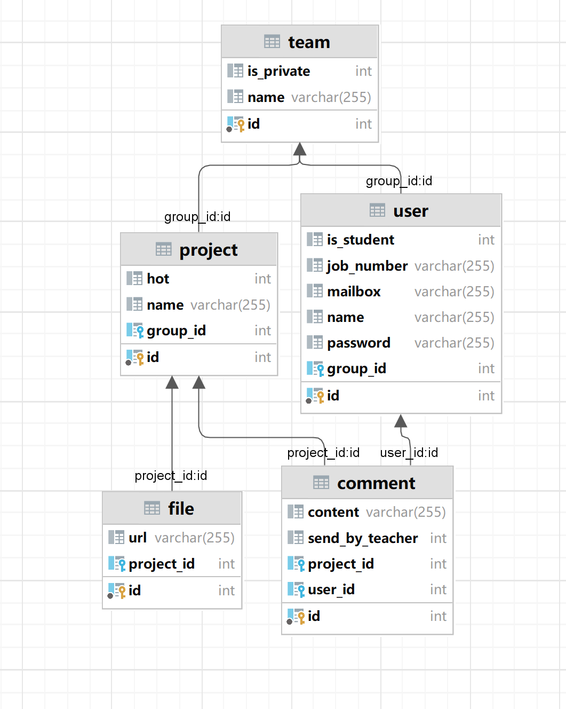

# [CS304] Team Project - Milestone 2

Project Name:Sustech Intelligent Manufacturing End-of-Term Project Display Platform

Project Member:hou yuxuan,chen panpan,luo ao,liu yuyu,li wenkai

## 1. Use Case Diagram

## 2. Swimlane Diagram

## 3. Natural Language Description
### A. Metadata
* Name: Comment
* Goal: Enable a user to post comments to a project
* Actor: Teacher, Student and Guest
* Trigger: The user wants to post a comment on the project management website.
* Entry conditions: The user must log in to the website first. The user must select a project to post the comment on.
* Post conditions:
    1. If the comment is published successfully, it will be visible on the website for other users to see.
    2. The user who posted the comment will be able to view their comment and any replies to it.
    3. If the user edited an existing comment, the updated comment will replace the original comment.
    4. The system will store the comment and its metadata (e.g., author, date, topic) in the database for future retrieval.
    5. If the comment does not meet the requirements, it will not be published, and no changes will be made to the website.
    6. If a teacher send a comment, he or she could choose to notify the relavant students. 
### B. Flow of events
------

#### Basic flow
1. The user enters the website and logs in.
2. The user selects a project to post the comment on.
3. The system displays a comment form, including the title and content fields.
4. The user fills in the title and content and submits the comment.
5. The system checks if the comment meets the requirements (e.g., if it violates guidelines).
6. If the comment meets the requirements, the system publishes the comment and notifies the user.
7. If the comment does not meet the requirements, the system rejects the comment and notifies the user.
8. If the user account is a teacher account, the user could choose to send an email to notify the relavant students.

------
#### Alternate flow:
4a. The user selects an existing comment and chooses to edit it.
4b. The system displays the comment form and pre-fills the title and content fields with the existing comment.
4c. The user modifies the title and content and submits the comment.

------
#### Exception flow:
5a. If the comment does not meet the requirements, the system displays an error message to the user regarding the issue and returns to step 3.

## 4. Diagrams for Logical view

## 5. Data Design

The data to be saved for the project includes 3D model files, user information, team information, project information and comment information.

We use 5 schemas in the database to store this information separately.

## 6. UI Design

## 7. Collaborations  
  
commit distributions:
|Member|Commit(%)|
|:---:|:---:|
|Hou Yuxuan|48.3%|
|Luo ao|8.0%|
|Li Wenkai|12.9%|
|Liu Yuyu|4.8%|
|Chen Panpan|25.8%|  
  
commit history graph:

## 8. Deliverables  
Most back-end interfaces have been completed.  

